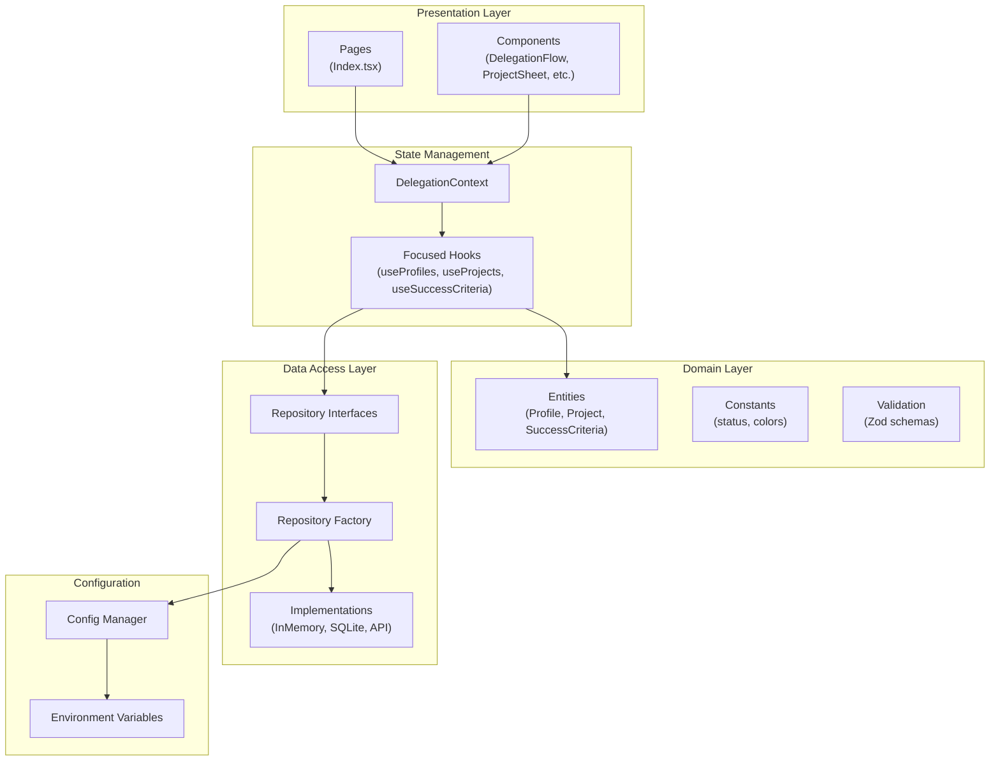
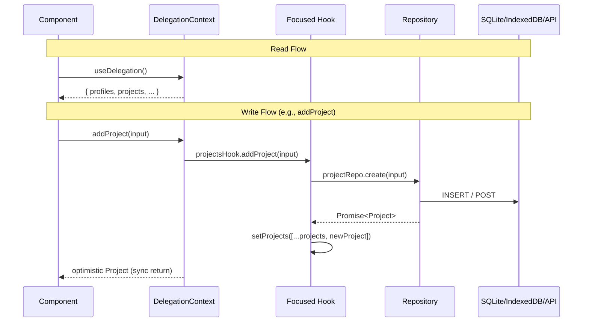
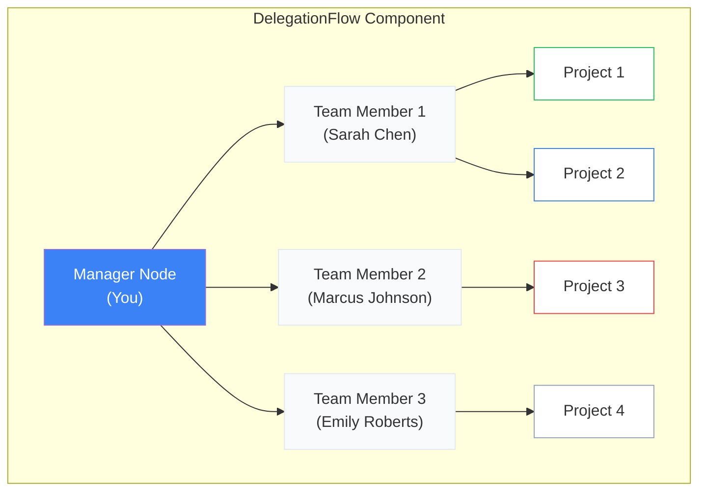
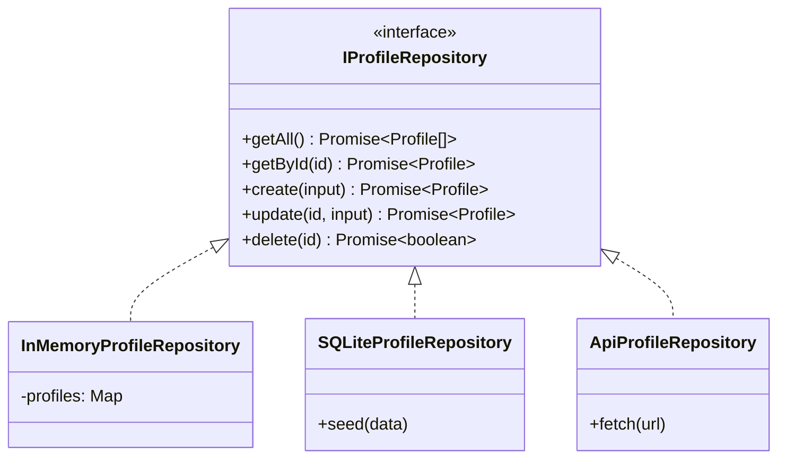

# AGENTS.md

## Commands
- `npm run dev:full` - Start both frontend (localhost:8081) and backend (localhost:3001) together
  - Frontend: Vite dev server with hot reload
  - Backend: Express server with SQLite at `./data/impact-flow.db`
- `npm run dev:server` - Start backend only (localhost:3001)
- `npm run dev` - Start frontend only (localhost:8080)
- `npm run build` - Production build
- `npm run lint` - Run ESLint
- `npm test` - Run all tests in watch mode
- `npm run test:run` - Run all tests once
- `vitest run src/path/to/file.test.ts` - Run a single test file

## Code Style
- **Imports**: Use `@/*` path alias for src imports (e.g., `import { Profile } from '@/domain'`)
- **Types**: Define interfaces in `src/domain/entities/`. Use `Create*Input = Omit<T, 'id'>` and `Update*Input = Partial<Omit<T, 'id'>>` patterns
- **Naming**: PascalCase for components/types, camelCase for functions/variables, kebab-case for files
- **Components**: Functional components with hooks. UI components in `src/components/ui/`
- **Tests**: Co-locate as `*.test.ts(x)`. Use `describe/it/expect` from Vitest with `@testing-library/react`
- **Validation**: Use Zod schemas in `src/domain/validation/`
- **Error handling**: Throw errors for missing repositories; check null before operations
- **Formatting**: 2-space indent, single quotes, no semicolons enforced (project uses mixed)

## Architecture Overview

**Impact Flow** is a visual team delegation dashboard built on the Impact Filter Framework from "Who Not How". It uses React Flow to visualize delegation hierarchies as mind maps.

### Tech Stack
- Vite + React 18 + TypeScript
- shadcn-ui (Radix UI primitives) + Tailwind CSS
- @xyflow/react (React Flow v12) for mind map visualization
- React Router v6 (single-page app)
- Zod for schema validation
- React Context + focused hooks for state management
- sql.js for in-browser SQLite with IndexedDB persistence (Client-side mode)
- Express + SQLite (Server-side mode)

## Project Structure

```
src/
├── App.tsx                    # Router setup + global providers
├── main.tsx                   # React DOM entry point
├── index.css                  # Global styles + CSS variables
│
├── pages/
│   ├── Index.tsx              # Main dashboard (DelegationProvider wrapper)
│   └── NotFound.tsx           # 404 page
│
├── components/
│   ├── delegation/            # Core domain components
│   │   ├── DelegationFlow.tsx     # React Flow mind map
│   │   ├── CustomNodes.tsx        # Node types (Manager, TeamMember, Project)
│   │   ├── ListView.tsx           # Grid/card view alternative
│   │   ├── ProjectSheet.tsx       # Project detail side panel
│   │   ├── AddDelegationWizard.tsx    # Multi-step project creation
│   │   └── AddTeamMemberDialog.tsx    # Add team member modal
│   └── ui/                    # shadcn-ui components (50+ pre-built)
│
├── context/
│   └── DelegationContext.tsx  # Composes hooks, provides sync API
│
├── hooks/
│   ├── useProfiles.ts         # Profile state management
│   ├── useProjects.ts         # Project state management
│   ├── useSuccessCriteria.ts  # Criteria state management
│   ├── use-mobile.tsx         # Responsive helper
│   └── use-toast.ts           # Toast notifications
│
├── domain/                    # Business logic layer
│   ├── entities/              # TypeScript interfaces
│   │   ├── Profile.ts
│   │   ├── Project.ts
│   │   └── SuccessCriteria.ts
│   ├── constants/
│   │   └── status.ts          # Status enums, colors, labels
│   └── validation/            # Zod schemas
│       ├── profileValidation.ts
│       ├── projectValidation.ts
│       └── criteriaValidation.ts
│
├── repositories/              # Data access layer
│   ├── interfaces/            # Repository contracts
│   │   ├── IProfileRepository.ts
│   │   ├── IProjectRepository.ts
│   │   └── ICriteriaRepository.ts
│   ├── implementations/
│   │   ├── memory/            # In-memory implementations
│   │   ├── sqlite/            # Client-side SQLite implementations
│   │   └── api/               # Server-side API implementations
│   └── factory.ts             # Repository factory (singleton)
│
├── config/                    # Configuration layer
│   ├── env.ts                 # Type-safe env variables
│   └── index.ts               # Centralized config export
│
└── lib/
    └── utils.ts               # Utility functions (cn)
```

## Layered Architecture



## Data Flow



## React Flow Mind Map Structure



## Data Model

### Entities

```typescript
// Profile - Team members
interface Profile {
  id: string;
  name: string;
  role: string;
  avatar?: string;
}

// Project - Delegations with Impact Filter fields
interface Project {
  id: string;
  profileId: string;          // FK to Profile
  name: string;
  purpose: string;            // The "why"
  importance: string;         // Why it matters
  idealOutcome: string;       // Desired end state
  status: ProjectStatus;      // planned | in_progress | complete | blocked
  dueDate: string | null;
  comments: string;
  createdAt: string;
}

// SuccessCriteria - Completion checkpoints
interface SuccessCriteria {
  id: string;
  projectId: string;          // FK to Project
  description: string;
  isComplete: boolean;
}
```

## Repository Pattern



## Configuration

### Environment Variables

```bash
# .env.local

# Storage backend
VITE_STORAGE_TYPE=server      # Options: memory, sqlite, server
# 'server' = Connects to localhost:3001 (Express + SQLite)
# 'sqlite' = Client-side WASM SQLite + IndexedDB
# 'memory' = Ephemeral in-memory

# SQLite persistence mode (only for VITE_STORAGE_TYPE=sqlite)
VITE_SQLITE_PERSISTENCE=indexeddb  # Options: memory, indexeddb

# Demo mode - loads sample data on first run
VITE_DEMO_MODE=true
```

## Key Patterns

### State Access
```typescript
// In any component within DelegationProvider
const {
  profiles,
  projects,
  successCriteria,
  addProfile,
  updateProject,
  deleteSuccessCriteria,
} = useDelegation();
```

### Repository Factory
```typescript
// Async initialization required for SQLite/Server modes
const repos = await initializeRepositories();
repos.profiles.getAll();
```

## SQLite Implementation Details

### How It Works

1. **WASM Loading**: sql.js loads SQLite compiled to WebAssembly from CDN
2. **Schema Init**: Tables created on first run (`profiles`, `projects`, `success_criteria`)
3. **Persistence**: After each mutation, database binary is saved to IndexedDB
4. **Restore**: On page load, database is restored from IndexedDB if available
5. **Debounced Saves**: `schedulePersist()` debounces writes (100ms) to avoid excessive I/O

### SQLite Files

```
src/repositories/implementations/sqlite/
├── SQLiteProfileRepository.ts   # Profile CRUD operations
├── SQLiteProjectRepository.ts   # Project CRUD operations
├── SQLiteCriteriaRepository.ts  # Criteria CRUD operations
├── index.ts                     # Exports
└── shared/
    ├── connection.ts            # initializeDatabase(), getDatabase(), persistDatabase()
    ├── schema.ts                # CREATE TABLE statements
    ├── persistence.ts           # IndexedDB save/load/clear
    └── mappers.ts               # SQL row to TypeScript entity conversion
```

### Clearing Browser Data

To reset the SQLite database, clear IndexedDB in browser DevTools:
- Chrome: DevTools > Application > IndexedDB > `impact-flow-sqlite` > Delete database

## SOLID Principles Applied
- **SRP**: Each hook manages one entity type
- **OCP**: Repository interfaces allow new implementations (like ApiRepository) without changing consumers
- **LSP**: All repository implementations are interchangeable
- **ISP**: Focused hooks provide only relevant operations
- **DIP**: Components depend on interfaces, not concrete implementations

## Current Limitations
- No authentication/multi-user support
- React Query installed but unused
- Supabase integration planned but not implemented

## Troubleshooting

### Data not persisting after refresh
1. Ensure `.env.local` has `VITE_STORAGE_TYPE=sqlite` and `VITE_SQLITE_PERSISTENCE=indexeddb`
2. Check browser console for `[SQLite]` log messages
3. Verify IndexedDB is not disabled in browser settings

### Textarea cursor jumping to end while typing
This was fixed by using local state in `ProjectSheet.tsx`. Text fields save on blur, not on every keystroke.
