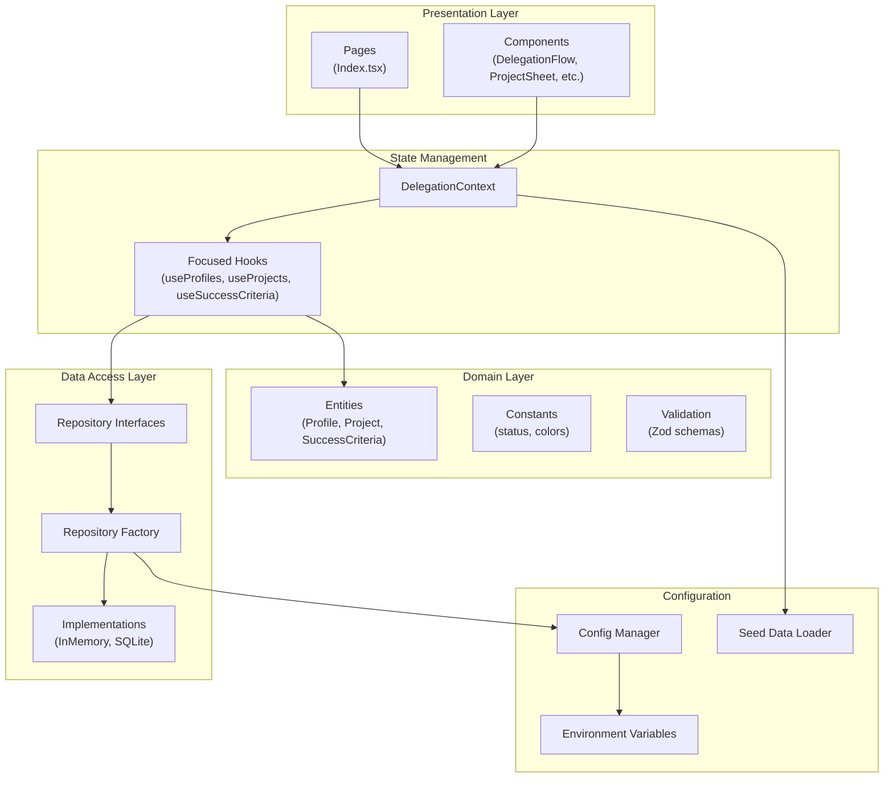
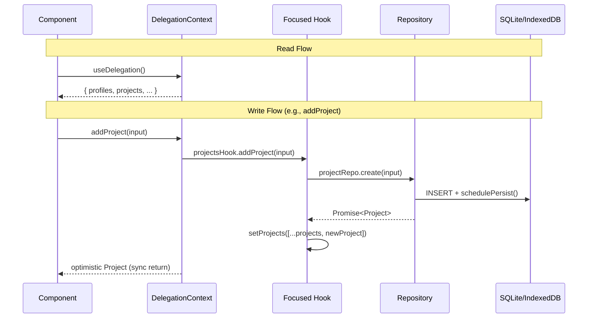
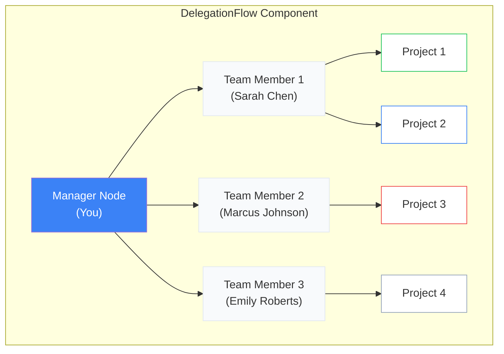
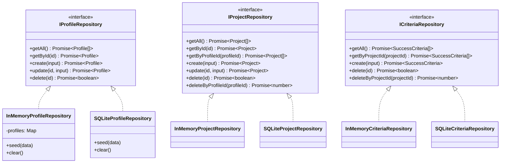

# CLAUDE.md

This file provides guidance to Claude Code (claude.ai/code) when working with code in this repository.

## Quick Start (New Developers)

```bash
# 1. Clone and install
git clone <repo-url>
cd impact-flow
npm install

# 2. Configure environment (SQLite with persistence)
cp .env.example .env.local
# Edit .env.local and set:
#   VITE_STORAGE_TYPE=sqlite
#   VITE_SQLITE_PERSISTENCE=indexeddb
#   VITE_DEMO_MODE=true

# 3. Start development server
npm run dev
# Opens at http://localhost:8080
```

## Build & Development Commands

```bash
npm install          # Install dependencies
npm run dev          # Start dev server (localhost:8080)
npm run build        # Production build
npm run build:dev    # Development build
npm run lint         # Run ESLint
npm run preview      # Preview production build
```

## Architecture Overview

**Impact Flow** is a visual team delegation dashboard built on the Impact Filter Framework from "Who Not How". It uses React Flow to visualize delegation hierarchies as mind maps.

### Tech Stack

- Vite + React 18 + TypeScript
- shadcn-ui (Radix UI primitives) + Tailwind CSS
- @xyflow/react (React Flow v12) for mind map visualization
- React Router v6 (single-page app)
- Zod for schema validation
- React Context + focused hooks for state management
- sql.js for in-browser SQLite with IndexedDB persistence

## Project Structure

```
src/
├── App.tsx                    # Router setup + global providers
├── main.tsx                   # React DOM entry point
├── index.css                  # Global styles + CSS variables
│
├── pages/
│   ├── Index.tsx              # Main dashboard (DelegationProvider wrapper)
│   └── NotFound.tsx           # 404 page
│
├── components/
│   ├── delegation/            # Core domain components
│   │   ├── DelegationFlow.tsx     # React Flow mind map
│   │   ├── CustomNodes.tsx        # Node types (Manager, TeamMember, Project)
│   │   ├── ListView.tsx           # Grid/card view alternative
│   │   ├── ProjectSheet.tsx       # Project detail side panel
│   │   ├── AddDelegationWizard.tsx    # Multi-step project creation
│   │   └── AddTeamMemberDialog.tsx    # Add team member modal
│   └── ui/                    # shadcn-ui components (50+ pre-built)
│
├── context/
│   └── DelegationContext.tsx  # Composes hooks, provides sync API
│
├── hooks/
│   ├── useProfiles.ts         # Profile state management
│   ├── useProjects.ts         # Project state management
│   ├── useSuccessCriteria.ts  # Criteria state management
│   ├── use-mobile.tsx         # Responsive helper
│   └── use-toast.ts           # Toast notifications
│
├── domain/                    # Business logic layer
│   ├── entities/              # TypeScript interfaces
│   │   ├── Profile.ts
│   │   ├── Project.ts
│   │   └── SuccessCriteria.ts
│   ├── constants/
│   │   └── status.ts          # Status enums, colors, labels
│   └── validation/            # Zod schemas
│       ├── profileValidation.ts
│       ├── projectValidation.ts
│       └── criteriaValidation.ts
│
├── repositories/              # Data access layer
│   ├── interfaces/            # Repository contracts
│   │   ├── IProfileRepository.ts
│   │   ├── IProjectRepository.ts
│   │   └── ICriteriaRepository.ts
│   ├── implementations/
│   │   ├── memory/            # In-memory implementations
│   │   │   ├── InMemoryProfileRepository.ts
│   │   │   ├── InMemoryProjectRepository.ts
│   │   │   └── InMemoryCriteriaRepository.ts
│   │   └── sqlite/            # SQLite implementations
│   │       ├── SQLiteProfileRepository.ts
│   │       ├── SQLiteProjectRepository.ts
│   │       ├── SQLiteCriteriaRepository.ts
│   │       ├── index.ts
│   │       └── shared/
│   │           ├── connection.ts   # DB singleton, WASM loading
│   │           ├── schema.ts       # Table definitions
│   │           ├── persistence.ts  # IndexedDB save/load
│   │           └── mappers.ts      # Row to entity mapping
│   └── factory.ts             # Repository factory (singleton)
│
├── data/                      # Data initialization
│   ├── seedData.ts            # Demo/sample data
│   └── seedLoader.ts          # Conditional loader (skips if data exists)
│
├── config/                    # Configuration layer
│   ├── env.ts                 # Type-safe env variables
│   └── index.ts               # Centralized config export
│
└── lib/
    └── utils.ts               # Utility functions (cn)
```

## Layered Architecture



## Data Flow



## React Flow Mind Map Structure



## Data Model

### Entities

```typescript
// Profile - Team members
interface Profile {
  id: string;
  name: string;
  role: string;
  avatar?: string;
}

// Project - Delegations with Impact Filter fields
interface Project {
  id: string;
  profileId: string;          // FK to Profile
  name: string;
  purpose: string;            // The "why"
  importance: string;         // Why it matters
  idealOutcome: string;       // Desired end state
  status: ProjectStatus;      // planned | in_progress | complete | blocked
  dueDate: string | null;
  comments: string;
  createdAt: string;
}

// SuccessCriteria - Completion checkpoints
interface SuccessCriteria {
  id: string;
  projectId: string;          // FK to Project
  description: string;
  isComplete: boolean;
}
```

### Status Values

| Status | Color | Description |
|--------|-------|-------------|
| `planned` | Muted gray | Not yet started |
| `in_progress` | Primary blue | Currently active |
| `complete` | Green | Finished |
| `blocked` | Red/Destructive | Needs attention |

## Repository Pattern



## Configuration

### Environment Variables

```bash
# .env.local (create from .env.example)

# Storage backend
VITE_STORAGE_TYPE=sqlite      # Options: memory, sqlite, supabase (future)

# SQLite persistence mode
VITE_SQLITE_PERSISTENCE=indexeddb  # Options: memory (no persistence), indexeddb (persistent)

# Demo mode - loads sample data on first run
VITE_DEMO_MODE=true           # Set to false for empty database
```

### Storage Modes

| Mode | Persistence | Use Case |
|------|-------------|----------|
| `memory` | None (resets on refresh) | Quick testing, demos |
| `sqlite` + `memory` | None (resets on refresh) | Testing SQLite without persistence |
| `sqlite` + `indexeddb` | Browser IndexedDB | **Recommended for development** |

### Config Access

```typescript
import { config } from '@/config';

config.storage.type           // 'memory' | 'sqlite' | 'supabase'
config.sqlite.persistence     // 'memory' | 'indexeddb'
config.features.demoMode      // boolean
```

## Key Patterns

### State Access

```typescript
// In any component within DelegationProvider
const {
  profiles,
  projects,
  successCriteria,
  addProfile,
  updateProject,
  deleteSuccessCriteria,
  getProjectCriteria,
  getProfileProjects,
} = useDelegation();
```

### Repository Factory

```typescript
// Async initialization required for SQLite (WASM loading)
const repos = await initializeRepositories();
repos.profiles.getAll();
repos.projects.create(input);
```

### Path Alias

```typescript
import { Button } from '@/components/ui/button';
import { useDelegation } from '@/context/DelegationContext';
import { Profile } from '@/domain';
```

## SQLite Implementation Details

### How It Works

1. **WASM Loading**: sql.js loads SQLite compiled to WebAssembly from CDN
2. **Schema Init**: Tables created on first run (`profiles`, `projects`, `success_criteria`)
3. **Persistence**: After each mutation, database binary is saved to IndexedDB
4. **Restore**: On page load, database is restored from IndexedDB if available
5. **Debounced Saves**: `schedulePersist()` debounces writes (100ms) to avoid excessive I/O

### SQLite Files

```
src/repositories/implementations/sqlite/
├── SQLiteProfileRepository.ts   # Profile CRUD operations
├── SQLiteProjectRepository.ts   # Project CRUD operations
├── SQLiteCriteriaRepository.ts  # Criteria CRUD operations
├── index.ts                     # Exports
└── shared/
    ├── connection.ts            # initializeDatabase(), getDatabase(), persistDatabase()
    ├── schema.ts                # CREATE TABLE statements
    ├── persistence.ts           # IndexedDB save/load/clear
    └── mappers.ts               # SQL row to TypeScript entity conversion
```

### Clearing Browser Data

To reset the SQLite database, clear IndexedDB in browser DevTools:
- Chrome: DevTools > Application > IndexedDB > `impact-flow-sqlite` > Delete database

## SOLID Principles Applied

| Principle | Implementation |
|-----------|----------------|
| **SRP** | Each hook manages one entity type |
| **OCP** | Repository interfaces allow new implementations without changing consumers |
| **LSP** | All repository implementations are interchangeable |
| **ISP** | Focused hooks provide only relevant operations |
| **DIP** | Components depend on interfaces, not concrete implementations |

## Current Limitations

- No authentication/multi-user support
- React Query installed but unused
- Supabase integration planned but not implemented

## Troubleshooting

### Data not persisting after refresh
1. Ensure `.env.local` has `VITE_STORAGE_TYPE=sqlite` and `VITE_SQLITE_PERSISTENCE=indexeddb`
2. Check browser console for `[SQLite]` log messages
3. Verify IndexedDB is not disabled in browser settings

### Textarea cursor jumping to end while typing
This was fixed by using local state in `ProjectSheet.tsx`. Text fields save on blur, not on every keystroke.
