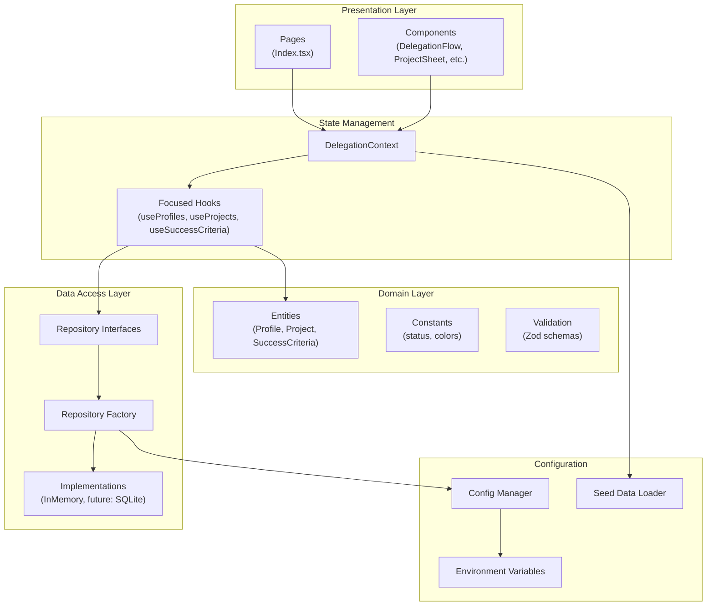
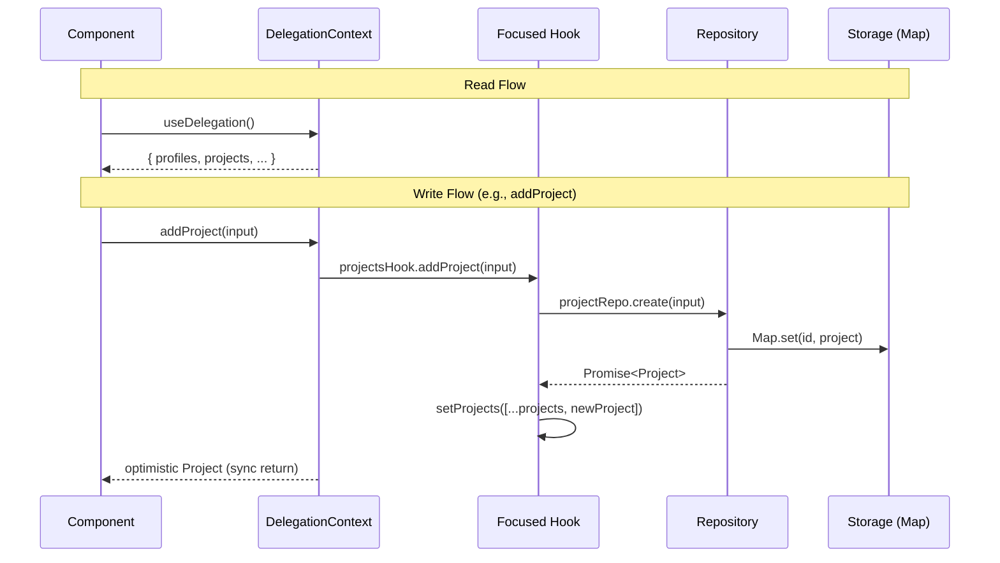
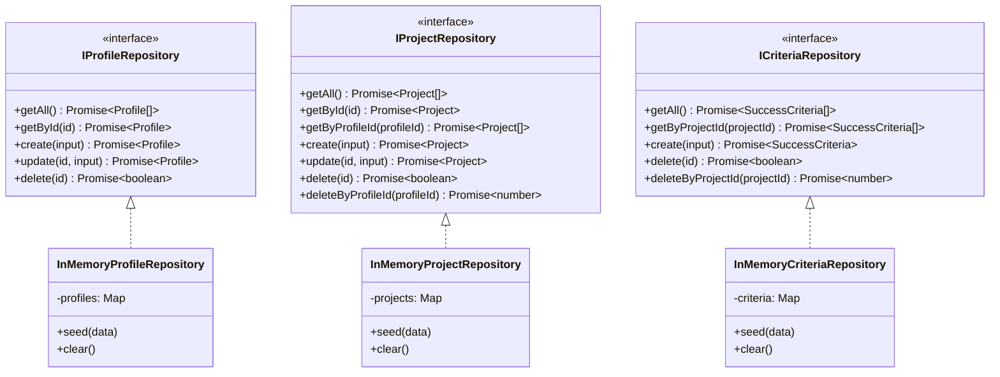

# CLAUDE.md

This file provides guidance to Claude Code (claude.ai/code) when working with code in this repository.

## Build & Development Commands

```bash
npm install          # Install dependencies
npm run dev          # Start dev server (localhost:8080)
npm run build        # Production build
npm run build:dev    # Development build
npm run lint         # Run ESLint
npm run preview      # Preview production build
```

## Architecture Overview

**Impact Flow** is a visual team delegation dashboard built on the Impact Filter Framework from "Who Not How". It uses React Flow to visualize delegation hierarchies as mind maps.

### Tech Stack

- Vite + React 18 + TypeScript
- shadcn-ui (Radix UI primitives) + Tailwind CSS
- @xyflow/react (React Flow v12) for mind map visualization
- React Router v6 (single-page app)
- Zod for schema validation
- React Context + focused hooks for state management

## Project Structure

```
src/
├── App.tsx                    # Router setup + global providers
├── main.tsx                   # React DOM entry point
├── index.css                  # Global styles + CSS variables
│
├── pages/
│   ├── Index.tsx              # Main dashboard (DelegationProvider wrapper)
│   └── NotFound.tsx           # 404 page
│
├── components/
│   ├── delegation/            # Core domain components
│   │   ├── DelegationFlow.tsx     # React Flow mind map
│   │   ├── CustomNodes.tsx        # Node types (Manager, TeamMember, Project)
│   │   ├── ListView.tsx           # Grid/card view alternative
│   │   ├── ProjectSheet.tsx       # Project detail side panel
│   │   ├── AddDelegationWizard.tsx    # Multi-step project creation
│   │   └── AddTeamMemberDialog.tsx    # Add team member modal
│   └── ui/                    # shadcn-ui components (50+ pre-built)
│
├── context/
│   └── DelegationContext.tsx  # Composes hooks, provides sync API
│
├── hooks/
│   ├── useProfiles.ts         # Profile state management
│   ├── useProjects.ts         # Project state management
│   ├── useSuccessCriteria.ts  # Criteria state management
│   ├── use-mobile.tsx         # Responsive helper
│   └── use-toast.ts           # Toast notifications
│
├── domain/                    # Business logic layer
│   ├── entities/              # TypeScript interfaces
│   │   ├── Profile.ts
│   │   ├── Project.ts
│   │   └── SuccessCriteria.ts
│   ├── constants/
│   │   └── status.ts          # Status enums, colors, labels
│   └── validation/            # Zod schemas
│       ├── profileValidation.ts
│       ├── projectValidation.ts
│       └── criteriaValidation.ts
│
├── repositories/              # Data access layer
│   ├── interfaces/            # Repository contracts
│   │   ├── IProfileRepository.ts
│   │   ├── IProjectRepository.ts
│   │   └── ICriteriaRepository.ts
│   ├── implementations/
│   │   └── memory/            # In-memory implementations
│   │       ├── InMemoryProfileRepository.ts
│   │       ├── InMemoryProjectRepository.ts
│   │       └── InMemoryCriteriaRepository.ts
│   └── factory.ts             # Repository factory (singleton)
│
├── data/                      # Data initialization
│   ├── seedData.ts            # Demo/sample data
│   └── seedLoader.ts          # Conditional loader
│
├── config/                    # Configuration layer
│   ├── env.ts                 # Type-safe env variables
│   └── index.ts               # Centralized config export
│
└── lib/
    └── utils.ts               # Utility functions (cn)
```

## Layered Architecture



## Data Flow



## React Flow Mind Map Structure


## Data Model

### Entities

```typescript
// Profile - Team members
interface Profile {
  id: string;
  name: string;
  role: string;
  avatar?: string;
}

// Project - Delegations with Impact Filter fields
interface Project {
  id: string;
  profileId: string;          // FK to Profile
  name: string;
  purpose: string;            // The "why"
  importance: string;         // Why it matters
  idealOutcome: string;       // Desired end state
  status: ProjectStatus;      // planned | in_progress | complete | blocked
  dueDate: string | null;
  comments: string;
  createdAt: string;
}

// SuccessCriteria - Completion checkpoints
interface SuccessCriteria {
  id: string;
  projectId: string;          // FK to Project
  description: string;
  isComplete: boolean;
}
```

### Status Values

| Status | Color | Description |
|--------|-------|-------------|
| `planned` | Muted gray | Not yet started |
| `in_progress` | Primary blue | Currently active |
| `complete` | Green | Finished |
| `blocked` | Red/Destructive | Needs attention |

## Repository Pattern



## Configuration

### Environment Variables

```bash
# .env or .env.local
VITE_STORAGE_TYPE=memory      # Options: memory, sqlite (future), supabase (future)
VITE_DEMO_MODE=true           # Load sample data on startup
```

### Config Access

```typescript
import { config } from '@/config';

config.storage.type    // 'memory' | 'sqlite' | 'supabase'
config.features.demoMode   // boolean
```

## Key Patterns

### State Access

```typescript
// In any component within DelegationProvider
const {
  profiles,
  projects,
  successCriteria,
  addProfile,
  updateProject,
  deleteSuccessCriteria,
  getProjectCriteria,
  getProfileProjects,
} = useDelegation();
```

### Repository Factory

```typescript
// Get singleton repositories (controlled by config)
const repos = getRepositories();
repos.profiles.getAll();
repos.projects.create(input);
```

### Path Alias

```typescript
import { Button } from '@/components/ui/button';
import { useDelegation } from '@/context/DelegationContext';
import { Profile } from '@/domain';
```

## SOLID Principles Applied

| Principle | Implementation |
|-----------|----------------|
| **SRP** | Each hook manages one entity type |
| **OCP** | Repository interfaces allow new implementations without changing consumers |
| **LSP** | All repository implementations are interchangeable |
| **ISP** | Focused hooks provide only relevant operations |
| **DIP** | Components depend on interfaces, not concrete implementations |

## Current Limitations

- In-memory storage only (data resets on page refresh)
- SQLite integration planned (see `sqlite_refactor.md`)
- React Query installed but unused
- No authentication/multi-user support

## Future: SQLite Integration

The repository pattern enables easy addition of persistent storage:

```
VITE_STORAGE_TYPE=sqlite npm run dev
```

See `sqlite_refactor.md` for implementation plan.
